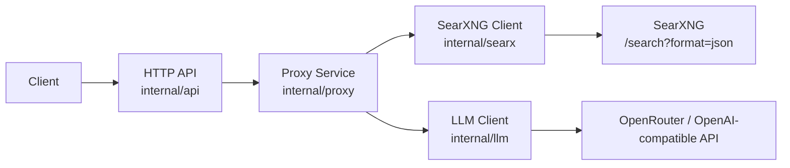
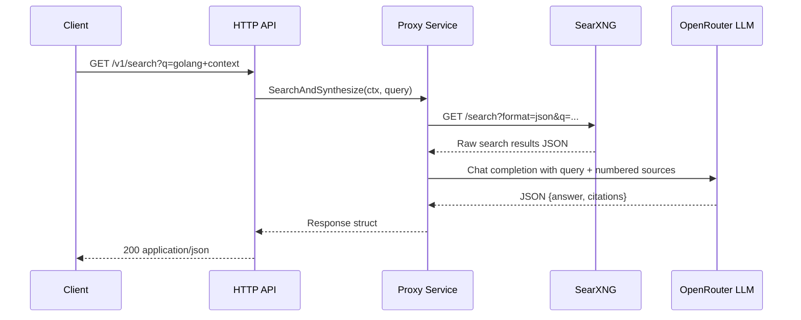

# Architecture

## Purpose

The Search Synthesis Proxy is a small, stateless Go service that takes a user query, searches the web via SearXNG, feeds the results to an LLM (via OpenRouter or any OpenAI-compatible API), and returns a synthesized answer with cited sources as JSON.

## High-level flow

1. Client sends `GET /v1/search?q=<query>`
2. The service queries SearXNG for raw search results
3. The top results are formatted into a numbered source list
4. A system prompt instructs the LLM to synthesize an answer using only the provided sources
5. The LLM returns JSON with an answer and citation indices
6. The service validates the response, maps citations to source objects, and returns the final JSON

## Package responsibilities

| Package | Role |
|---|---|
| `cmd/proxy` | Process entrypoint. Wires dependencies, starts HTTP server, handles graceful shutdown. |
| `internal/api` | HTTP transport layer. Routes requests, decodes parameters, encodes JSON responses, maps errors. |
| `internal/proxy` | Orchestration and business logic. Validates input, calls search and LLM, builds prompts, parses output. |
| `internal/searx` | SearXNG adapter. Queries the JSON search endpoint, normalizes results. |
| `internal/llm` | LLM adapter. Wraps the openai-go SDK for OpenRouter-compatible chat completions. |
| `internal/config` | Configuration. Reads and validates environment variables with sensible defaults. |

## Request lifecycle

### Detailed steps

1. **Validation**: The proxy service trims the query, rejects empty or too-long (>2048 byte) queries.
2. **Search**: SearXNG is queried with `format=json`. Results are normalized (whitespace collapsed, empty URLs dropped).
3. **Truncation**: Results are capped at `MAX_SEARCH_RESULTS` (default 5) and renumbered 1..N.
4. **No-result shortcut**: If no usable results are found, the LLM is not called. A deterministic "no results" answer is returned.
5. **Prompt building**: A strict system prompt instructs the model to return only JSON. The user prompt contains the query and numbered sources.
6. **LLM call**: A chat completion request is sent via the openai-go SDK with `developer` and `user` messages.
7. **Parsing**: The model output is stripped of optional markdown fences, parsed as JSON, and validated (non-empty answer, valid citation indices).
8. **Response**: The final JSON includes the answer, cited sources, and metadata (model name, timing, result count).

## Failure handling

Errors are mapped to a typed `AppError` with HTTP status code, machine-readable code, and safe user-facing message:

| Scenario | HTTP | Code |
|---|---|---|
| Missing/empty query | 400 | `invalid_query` |
| Query too long | 400 | `query_too_long` |
| Wrong HTTP method | 405 | `method_not_allowed` |
| SearXNG failure | 502 | `search_upstream_error` |
| SearXNG invalid JSON | 502 | `search_upstream_error` |
| LLM request failed | 502 | `llm_upstream_error` |
| LLM empty response | 502 | `llm_empty_response` |
| LLM invalid JSON | 502 | `llm_invalid_json` |
| LLM invalid payload | 502 | `llm_invalid_payload` |
| Internal error | 500 | `internal_error` |

All error responses follow the shape: `{"error":{"code":"...","message":"..."}}`

## Why Chat Completions (not Responses API)

OpenRouter compatibility is broadest and most battle-tested around OpenAI-compatible chat-completions semantics. The Responses API is newer and may not be supported by all providers. Chat Completions reduces integration risk for v1.

## Why no database/cache

The service is intentionally stateless in v1. Each request is independent. This keeps the deployment simple and eliminates operational overhead. Caching can be added in a future version if needed.

## How citations work

1. Search results are numbered 1..N after truncation
2. The LLM is asked to return `"citations": [1, 2, 3]` referencing these numbers
3. The proxy service validates each citation: must be >= 1, <= N, and unique
4. Invalid citations are silently dropped
5. Only cited sources appear in the final response

## Tradeoffs / v1 limitations

- **No streaming**: Responses are synchronous. The client waits for the full pipeline.
- **No caching**: Every request hits SearXNG and the LLM. Costs are per-request.
- **No retries**: Upstream failures fail fast. SDK retries are disabled (`WithMaxRetries(0)`).
- **No persistence**: No database, no sessions, no request history.
- **Single prompt strategy**: One system prompt + one user prompt. No multi-turn or follow-up.
- **Fixed model**: One model per deployment. No per-request model selection.
